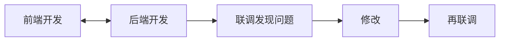
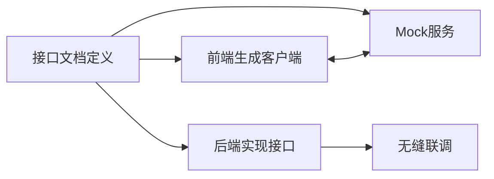

# S2R：基于 Swagger/OpenAPI 的 TypeScript API 客户端生成工具

## 前言

在前端开发的日常工作中，你是否遇到过这样的场景：花费大量时间手写各种请求函数，到了联调阶段却发现接口定义与前端实现存在差异？S2R (Swagger-2-Request) 是一个帮助解决这些痛点的工具。

## 痛点一：前端请求函数定义的复杂性

### 传统开发的困境

在传统的前端开发中，我们需要为每个 API 接口手写请求函数：

```typescript
// 传统方式：手写各种请求函数
const getUserInfo = async (userId: string) => {
  const response = await axios.get(`/api/users/${userId}`);
  return response.data;
};

const updateUserProfile = async (userId: string, data: any) => {
  const response = await axios.put(`/api/users/${userId}`, data);
  return response.data;
};

const getUserList = async (params: any) => {
  const response = await axios.get('/api/users', { params });
  return response.data;
};

// ... 还有几十个类似的函数
```

**这种方式的问题：**
- 重复劳动：每个接口都需要手写，工作量较大
- 容易出错：URL 拼写错误、参数类型错误等问题
- 维护困难：接口变更时需要逐个修改
- 类型缺失：缺乏类型约束，运行时才发现错误

### S2R 的解决方案

```typescript
// S2R 自动生成的类型安全 API 客户端
import { 
  userIdGet, 
  userIdPut, 
  userGet,
  type User,
  type UpdateUserRequest 
} from './src/service';

// 完全类型安全，IDE 智能提示
const user: User = await userIdGet({ id: '123' });
const updatedUser = await userIdPut({ 
  id: '123', 
  data: { name: 'John', email: 'john@example.com' } 
});
const users = await userGet({ page: 1, limit: 10 });
```

**S2R 的优势：**
- 零手写：基于 Swagger 文档自动生成所有 API 函数
- 类型安全：完整的 TypeScript 类型定义
- 智能提示：IDE 提供完整的代码补全和错误检查
- 自动同步：文档更新后重新生成即可

## 痛点二：联调时的接口定义差异

### 常见的联调噩梦

相信每个前端开发者都经历过这样的场景：

```typescript
// 前端定义的接口
interface UserInfo {
  id: string;
  name: string;
  email: string;
  avatar: string;
}

// 实际后端返回的数据
{
  "user_id": "123",           // 字段名不一致！
  "username": "John",         // 字段名不一致！
  "email_address": "john@example.com", // 字段名不一致！
  "profile_image": "avatar.jpg",       // 字段名不一致！
  "created_at": "2024-01-01",          // 前端没有这个字段！
  "is_active": true                    // 前端没有这个字段！
}
```

**联调时的常见问题：**
- 字段名称不匹配（驼峰 vs 下划线）
- 字段类型不一致（string vs number）
- 必填字段遗漏
- 新增字段未通知前端
- 枚举值定义不同步

### S2R 如何解决这个问题

S2R 推崇 "接口文档先行" 的开发方式：

1. **后端先定义标准的 Swagger 文档**
2. **前端基于文档生成客户端代码**
3. **确保前后端使用同一份"真理源"**

```yaml
# 后端定义的标准 Swagger 文档
paths:
  /api/users/{userId}:
    get:
      parameters:
        - name: userId
          in: path
          required: true
          schema:
            type: string
      responses:
        '200':
          content:
            application/json:
              schema:
                $ref: '#/components/schemas/User'

components:
  schemas:
    User:
      type: object
      required: [id, name, email]
      properties:
        id:
          type: string
          description: 用户唯一标识
        name:
          type: string
          description: 用户姓名
        email:
          type: string
          format: email
          description: 用户邮箱
        avatar:
          type: string
          description: 用户头像URL
```

基于这份文档，S2R 自动生成：

```typescript
// 自动生成的类型定义，与后端完全一致
export interface User {
  /** 用户唯一标识 */
  id: string;
  /** 用户姓名 */
  name: string;
  /** 用户邮箱 */
  email: string;
  /** 用户头像URL */
  avatar?: string;
}

// 自动生成的 API 函数
export const getUserById = async (params: {
  userId: string;
}): Promise<User> => {
  const response = await apiClient.get(`/api/users/${params.userId}`);
  return response.data;
};
```

**这样做的好处：**
- 零差异：前后端使用同一份接口定义
- 实时同步：后端更新文档，前端重新生成即可
- 类型保证：编译时就能发现接口不匹配问题
- 文档即代码：接口文档就是最准确的代码实现

## 痛点三：接口文档先行的开发方式

### 传统开发流程的问题

在传统的开发流程中，往往是前后端各自开发，最后再进行联调：



这种方式的问题：
- 并行开发困难：前端需要等待后端接口完成
- Mock 数据不准确：前端自己造的假数据与真实接口差异较大
- 联调问题多：到了联调阶段才发现各种不匹配问题

### S2R 推崇的"接口文档先行"开发方式

S2R 推崇一种开发方式：接口文档先行，前后端并行开发



**具体流程：**

1. **产品/架构师定义接口文档**

团队首先定义完整的 Swagger/OpenAPI 文档，包含所有接口的路径、参数、响应结构等信息。

2. **前端基于文档启动 Mock 服务**
```bash
# 一键启动 Mock 服务，支持多种数据类型
s2r mock ./api-docs.yaml --port 3001
```

S2R 的 Mock 服务支持丰富的数据类型匹配：

```typescript
// 自动生成符合 Schema 的 Mock 数据
{
  "products": [
    {
      "id": "prod_1234567890",        // string 类型
      "name": "iPhone 15 Pro",        // string 类型
      "price": 999.99,                // number 类型
      "category": "electronics",      // enum 类型
      "inStock": true,                // boolean 类型
      "tags": ["smartphone", "apple"], // array 类型
      "specs": {                      // object 类型
        "color": "Natural Titanium",
        "storage": "256GB"
      },
      "createdAt": "2024-01-15T10:30:00Z" // date-time 格式
    }
  ],
  "total": 156,
  "page": 1
}
```

**S2R Mock 服务的智能数据生成：**
- 类型匹配：根据 Schema 定义生成对应类型的数据
- 格式识别：自动识别 email、date、uuid 等格式
- 枚举支持：严格按照枚举值生成数据
- 约束遵循：遵循 minimum、maximum、pattern 等约束
- 嵌套结构：支持复杂的嵌套对象和数组

3. **前后端并行开发**
```typescript
// 前端可以立即开始开发，使用 Mock 数据
import { getProductList } from './api/generated';

const ProductList = () => {
  const [products, setProducts] = useState([]);
  
  useEffect(() => {
    // 使用 Mock 服务进行开发
    getProductList({ category: 'electronics', page: 1 })
      .then(response => setProducts(response.products));
  }, []);
  
  return (
    <div>
      {products.map(product => (
        <ProductCard key={product.id} product={product} />
      ))}
    </div>
  );
};
```

4. **后端实现真实接口**
后端开发者按照 Swagger 文档实现对应的接口，确保返回的数据结构符合 Schema 定义。

5. **无缝切换到真实接口**
```typescript
// 只需要修改 baseURL，其他代码无需改动
const apiClient = createApiClient({
  // baseURL: 'http://localhost:3001',  // Mock 服务
  baseURL: 'https://api.production.com', // 真实接口
});
```

## 痛点四：AI 时代的文档生成需求

### Vibe Coding 时代的新挑战

在 AI 辅助编程的时代，我们经常需要让 AI 快速理解我们的 API 接口。但是传统的 Swagger 文档对 AI 来说并不够友好：

```yaml
# 传统 Swagger 文档 - 对 AI 不够友好
paths:
  /api/users/{id}:
    get:
      operationId: getUserById
      parameters:
        - name: id
          in: path
          required: true
          schema:
            type: string
      responses:
        '200':
          content:
            application/json:
              schema:
                $ref: '#/components/schemas/User'
```

### S2R 的 AI 友好文档生成

S2R 提供了 `ai-docs` 命令，可以将 Swagger 文档转换为 AI 更容易理解的格式：

```bash
# 生成 AI 友好的文档
s2r ai-docs ./swagger.json --output ./docs/ai-friendly.md
```

生成的 AI 友好文档：

```markdown
# API 接口文档 - AI 友好版本

## 用户管理接口

### 获取用户信息
**接口路径：** `GET /api/users/{id}`
**功能描述：** 根据用户ID获取用户的详细信息
**使用场景：** 用户个人资料页面、用户信息展示等

**请求参数：**
- `id` (路径参数，必填): 用户的唯一标识符，类型为字符串

**响应数据结构：**
```typescript
interface User {
  id: string;          // 用户唯一标识
  name: string;        // 用户姓名
  email: string;       // 用户邮箱地址
  avatar?: string;     // 用户头像URL（可选）
  createdAt: string;   // 账户创建时间
  isActive: boolean;   // 账户是否激活
}
```

**调用示例：**
```typescript
// 获取ID为"123"的用户信息
const user = await getUserById({ id: "123" });
console.log(user.name); // 输出用户姓名
```

**错误处理：**
- 404: 用户不存在
- 401: 未授权访问
- 500: 服务器内部错误
```

**AI 友好文档的优势：**
- 自然语言描述：用人类易懂的语言描述接口功能
- 使用场景说明：明确接口的应用场景
- 完整示例代码：提供可直接使用的代码示例
- 错误处理指南：详细的错误码和处理方式
- 类型注释完整：每个字段都有详细的类型和用途说明

这样的文档让 AI 能够更好地理解你的 API，生成更准确的代码建议。

## S2R 的两种核心使用方式

根据不同的项目需求和团队规模，S2R 提供了两种主要的使用方式：

### 方式一：生成 API 及客户端代码到项目内

**适用场景：**
- 单体应用：前端项目相对独立，API 调用逻辑紧密耦合
- 快速开发：需要快速迭代，不想维护额外的 NPM 包
- 定制化需求：需要对生成的代码进行深度定制

**使用流程：**

1. **项目初始化**
```bash
# 在你的前端项目根目录下
npm install -g swagger-2-request

# 初始化 S2R 配置
s2r init
```

2. **配置文件设置**
```javascript
// s2r.config.js
module.exports = {
  input: 'https://api.example.com/swagger.json',
  output: './src/api',           // 直接生成到项目的 src/api 目录
  client: 'axios',
  typescript: true,
  overwrite: true,               // 允许覆盖已有文件
  hooks: {
    afterGenerate: () => {
      console.log('API 客户端代码已更新！');
    }
  }
};
```

3. **生成代码到项目内**
```bash
# 生成 API 客户端代码
s2r generate
```

生成的项目结构：
```
src/
├── service/
│   ├── index.ts           # 主入口文件
│   ├── types.ts           # TypeScript 类型定义
│   ├── request.ts         # HTTP 客户端配置
│   └── api.ts             # API 函数定义
├── components/
├── pages/
└── utils/
```

4. **在项目中使用**
```typescript
// 在 React 组件中使用
import { userIdGet, type User } from '@/service';

const UserProfile = ({ userId }: { userId: string }) => {
  const [user, setUser] = useState<User | null>(null);
  
  useEffect(() => {
    userIdGet({ id: userId })
      .then(setUser)
      .catch(console.error);
  }, [userId]);
  
  return (
    <div>
      {user && (
        <>
          <h1>{user.name}</h1>
          <p>{user.email}</p>
        </>
      )}
    </div>
  );
};


```

**优势：**
- 零依赖：生成的代码直接在项目内，无需额外的 NPM 包依赖
- 完全控制：可以自由修改生成的代码，满足特殊需求
- 构建优化：打包工具可以更好地进行 Tree Shaking
- 调试方便：可以直接在生成的代码中添加断点调试

### 方式二：创建独立的 NPM 包

**适用场景：**
- 微服务架构：多个前端项目需要共享同一套 API 客户端
- 团队协作：不同团队需要使用相同的 API 接口
- 版本管理：需要对 API 客户端进行版本控制和发布管理
- 跨项目复用：API 客户端需要在多个项目中复用

**使用流程：**

1. **创建 API 客户端包**
```bash
# 创建一个新的 NPM 包项目
s2r create my-api-client https://api.example.com/swagger.json
cd my-api-client
```

S2R 会自动生成一个完整的 NPM 包结构：
```
my-api-client/
├── package.json
├── tsconfig.json
├── rollup.config.js       # 打包配置
├── src/
│   ├── index.ts
│   ├── client.ts
│   ├── types.ts
│   └── services/
├── dist/                  # 构建输出目录
├── docs/                  # 自动生成的文档
└── tests/                 # 测试文件
```

2. **配置 API 源**
```javascript
// s2r.config.js
module.exports = {
  input: 'https://api.example.com/swagger.json',
  output: './src',
  client: 'axios',
  typescript: true,
  packageName: 'my-api-client',
  version: '1.0.0',
  description: 'API client for Example Service',
  author: 'Your Name',
  repository: 'https://github.com/yourname/my-api-client'
};
```

3. **生成并构建包**
```bash
# 生成 API 客户端代码
s2r generate

# 构建 NPM 包
npm run build

# 运行测试
npm test

# 发布到 NPM
npm publish
```

4. **在项目中安装和使用**
```bash
# 在需要使用 API 的项目中安装
npm install my-api-client
```

```typescript
// 在项目中使用
import { userGet, createApiClient } from 'my-api-client';

// 配置客户端
createApiClient({
  baseURL: 'https://api.example.com',
  timeout: 10000,
  headers: {
    'Authorization': `Bearer ${token}`
  }
});

// 使用 API 函数
const users = await userGet();
```

5. **版本管理和更新**
```bash
# 当 API 更新时，更新客户端包
s2r generate
npm run build
npm version patch  # 或 minor/major
npm publish

# 在使用项目中更新
npm update my-api-client
```

**优势：**
- 统一管理：多个项目使用同一个 API 客户端，保证一致性
- 版本控制：可以精确控制不同项目使用的 API 客户端版本
- 独立发布：API 客户端的更新不影响业务项目的发布节奏
- 团队协作：不同团队可以独立维护和使用 API 客户端
- 文档完整：自动生成完整的 API 文档和使用说明

### 两种方式的选择建议

| 项目特征 | 推荐方式 | 理由 |
|---------|---------|------|
| 单个前端项目 | 方式一：项目内生成 | 简单直接，无需维护额外包 |
| 多个项目共享 API | 方式二：独立 NPM 包 | 统一管理，避免重复开发 |
| 快速原型开发 | 方式一：项目内生成 | 快速迭代，灵活修改 |
| 企业级应用 | 方式二：独立 NPM 包 | 规范管理，版本控制 |
| 开源项目 | 方式二：独立 NPM 包 | 便于社区使用和贡献 |
| 学习和实验 | 方式一：项目内生成 | 可以查看和修改生成代码 |

## S2R 的内置能力深度解析

### 1. 智能类型推断与生成

S2R 不仅仅是简单的代码生成工具，它具备强大的类型推断能力：

**复杂嵌套类型处理：**
```yaml
# Swagger 定义
components:
  schemas:
    ApiResponse:
      type: object
      properties:
        code:
          type: integer
        message:
          type: string
        data:
          oneOf:
            - $ref: '#/components/schemas/User'
            - $ref: '#/components/schemas/Product'
            - type: array
              items:
                $ref: '#/components/schemas/Order'
```

```typescript
// S2R 生成的智能类型
export type ApiResponse<T = unknown> = {
  code: number;
  message: string;
  data: T;
};

export type UserResponse = ApiResponse<User>;
export type ProductResponse = ApiResponse<Product>;
export type OrderListResponse = ApiResponse<Order[]>;

// 类型安全的 API 调用
const userResponse: UserResponse = await getUserById({ id: '123' });
const orders: OrderListResponse = await getOrderList();
```

**枚举类型智能处理：**
```yaml
# Swagger 枚举定义
UserStatus:
  type: string
  enum: [active, inactive, pending, suspended]
  description: 用户状态
```

```typescript
// 生成的枚举类型
export enum UserStatus {
  ACTIVE = 'active',
  INACTIVE = 'inactive', 
  PENDING = 'pending',
  SUSPENDED = 'suspended'
}

// 类型安全的使用
const updateUserStatus = (userId: string, status: UserStatus) => {
  return updateUser({ id: userId, status }); // 编译时类型检查
};
```

### 2. 高级 Mock 数据生成

S2R 的 Mock 服务不是简单的静态数据返回，而是智能的动态数据生成系统：

**智能数据关联：**
```typescript
// S2R 能够理解数据之间的关联关系
{
  "user": {
    "id": "user_1234567890",
    "email": "john.doe@example.com",
    "name": "John Doe"  // 与 email 保持一致的命名
  },
  "orders": [
    {
      "id": "order_1234567890", 
      "userId": "user_1234567890",  // 自动关联用户ID
      "amount": 299.99,
      "currency": "USD"
    }
  ]
}
```

**业务场景模拟：**
```bash
# 启动带有业务逻辑的 Mock 服务
s2r mock ./swagger.json --scenarios
```

```javascript
// S2R 支持自定义业务场景
// mock-scenarios.js
module.exports = {
  // 模拟分页逻辑
  'GET /api/users': (req, res) => {
    const { page = 1, limit = 10 } = req.query;
    const total = 156;
    const users = generateUsers(limit);
    
    res.json({
      users,
      pagination: {
        page: parseInt(page),
        limit: parseInt(limit),
        total,
        pages: Math.ceil(total / limit)
      }
    });
  },
  
  // 模拟错误场景
  'POST /api/orders': (req, res) => {
    const { userId, items } = req.body;
    
    // 模拟库存不足的情况
    if (items.some(item => item.quantity > 10)) {
      return res.status(400).json({
        error: 'INSUFFICIENT_STOCK',
        message: '库存不足'
      });
    }
    
    res.json(generateOrder({ userId, items }));
  }
};
```

### 3. 请求/响应拦截与转换

S2R 提供了强大的请求和响应处理能力：

**自动请求转换：**
```typescript
// 自动处理不同的参数传递方式
export const getUserById = async (params: {
  id: string;           // path 参数
  include?: string[];   // query 参数
  headers?: Record<string, string>; // header 参数
}) => {
  // S2R 自动处理参数的正确位置
  const { id, include, headers, ...queryParams } = params;
  
  return apiClient.get(`/api/users/${id}`, {
    params: { include: include?.join(','), ...queryParams },
    headers
  });
};
```

**响应数据标准化：**
```typescript
// 自动处理不同的响应格式
const apiClient = createApiClient({
  responseTransform: (response) => {
    // 统一处理后端返回的不同格式
    if (response.data.success !== undefined) {
      // 格式1: { success: true, data: {...}, message: "" }
      return response.data.success ? response.data.data : Promise.reject(response.data);
    } else if (response.data.code !== undefined) {
      // 格式2: { code: 200, data: {...}, msg: "" }
      return response.data.code === 200 ? response.data.data : Promise.reject(response.data);
    }
    // 格式3: 直接返回数据
    return response.data;
  }
});
```

### 4. 错误处理与重试机制

**智能错误分类：**
```typescript
// S2R 生成的错误处理
export class ApiError extends Error {
  constructor(
    public status: number,
    public code: string,
    message: string,
    public details?: any
  ) {
    super(message);
  }
  
  // 判断错误类型
  isNetworkError() { return this.status === 0; }
  isClientError() { return this.status >= 400 && this.status < 500; }
  isServerError() { return this.status >= 500; }
  isRetryable() { return this.isNetworkError() || this.isServerError(); }
}

// 自动重试机制
const apiClient = createApiClient({
  retry: {
    times: 3,
    delay: 1000,
    condition: (error) => error.isRetryable()
  }
});
```

### 5. 缓存与性能优化

**智能缓存策略：**
```typescript
// S2R 支持多种缓存策略
const apiClient = createApiClient({
  cache: {
    // 内存缓存
    memory: {
      ttl: 5 * 60 * 1000, // 5分钟
      max: 100 // 最多缓存100个请求
    },
    // 本地存储缓存
    localStorage: {
      prefix: 'api_cache_',
      ttl: 24 * 60 * 60 * 1000 // 24小时
    },
    // 自定义缓存键
    keyGenerator: (url, params) => {
      return `${url}_${JSON.stringify(params)}`;
    }
  }
});

// 使用缓存的 API 调用
const user = await getUserById({ id: '123' }); // 第一次请求
const userCached = await getUserById({ id: '123' }); // 从缓存返回
```

**请求去重：**
```typescript
// 自动处理重复请求
const apiClient = createApiClient({
  deduplication: true // 相同的请求会被自动去重
});

// 这两个请求会被合并为一个
const [user1, user2] = await Promise.all([
  getUserById({ id: '123' }),
  getUserById({ id: '123' })
]);
```

### 6. 开发调试支持

**详细的调试信息：**
```typescript
// 开发模式下的详细日志
const apiClient = createApiClient({
  debug: process.env.NODE_ENV === 'development',
  logger: {
    request: (config) => {
      console.log('🚀 API Request:', {
        method: config.method,
        url: config.url,
        params: config.params,
        data: config.data
      });
    },
    response: (response) => {
      console.log('✅ API Response:', {
        status: response.status,
        data: response.data,
        duration: response.config.metadata?.duration
      });
    },
    error: (error) => {
      console.error('❌ API Error:', {
        status: error.status,
        message: error.message,
        details: error.details
      });
    }
  }
});
```

**性能监控：**
```typescript
// 内置性能监控
const apiClient = createApiClient({
  performance: {
    enabled: true,
    slowRequestThreshold: 2000, // 2秒以上的请求会被标记为慢请求
    onSlowRequest: (config, duration) => {
      console.warn(`Slow API request detected: ${config.url} took ${duration}ms`);
      // 可以发送到监控系统
      analytics.track('slow_api_request', {
        url: config.url,
        duration,
        method: config.method
      });
    }
  }
});
```

### 7. 参数过滤与验证 - 解决前后端联调争议的利器

**这是 S2R 最实用的内置能力之一**，彻底解决了前后端联调时因为参数不对齐导致的争议和问题。

#### 传统联调中的常见问题

在传统的前后端联调过程中，经常会遇到这样的场景：

```typescript
// 前端发送的请求
const requestData = {
  name: 'John Doe',
  email: 'john@example.com',
  age: 25,
  avatar: null,           // 前端传了 null
  preferences: undefined, // 前端传了 undefined
  extraField: 'some value' // 前端多传了字段
};

fetch('/api/users', {
  method: 'POST',
  body: JSON.stringify(requestData)
});
```

**后端收到的数据问题：**
- null 值处理：后端可能不期望收到 null 值
- undefined 字段：JSON 序列化后 undefined 字段消失，但可能影响逻辑
- 多余字段：前端传了后端不需要的字段，可能导致验证失败
- 类型不匹配：前端传字符串，后端期望数字

**联调时的争议：**
```
后端："你传的参数格式不对，age 应该是数字不是字符串"
前端："我明明传的是数字啊，你看代码..."
后端："还有这个 avatar 字段，你为什么传 null？"
前端："接口文档没说不能传 null 啊..."
```

#### S2R 的智能参数过滤解决方案

S2R 根据 Swagger 文档的 Schema 定义，自动进行参数过滤和转换：

**1. 自动类型转换**
```yaml
# Swagger 定义
components:
  schemas:
    CreateUserRequest:
      type: object
      properties:
        name:
          type: string
        age:
          type: integer
          minimum: 0
          maximum: 150
        email:
          type: string
          format: email
        isActive:
          type: boolean
          default: true
      required: [name, email]
```

```typescript
// S2R 生成的智能参数处理
export const createUser = async (params: CreateUserRequest) => {
  // 自动参数过滤和转换
  const filteredParams = filterAndTransformParams(params, {
    // 根据 Schema 自动过滤
    allowedFields: ['name', 'age', 'email', 'isActive'],
    // 自动类型转换
    transforms: {
      age: (value) => {
        if (typeof value === 'string') {
          const num = parseInt(value, 10);
          return isNaN(num) ? undefined : num;
        }
        return value;
      },
      isActive: (value) => {
        if (typeof value === 'string') {
          return value === 'true' || value === '1';
        }
        return Boolean(value);
      }
    },
    // 自动移除 null/undefined
    removeNullish: true,
    // 验证必填字段
    required: ['name', 'email']
  });
  
  return apiClient.post('/api/users', filteredParams);
};
```

**2. 实际使用效果对比**

```typescript
// 前端调用（可能有各种"脏"数据）
const userData = {
  name: 'John Doe',
  age: '25',              // 字符串类型的数字
  email: 'john@example.com',
  isActive: 'true',       // 字符串类型的布尔值
  avatar: null,           // null 值
  preferences: undefined, // undefined 值
  extraField: 'ignored',  // 多余字段
  '': 'empty key'         // 空键名
};

// S2R 自动处理后发送给后端的数据
// {
//   "name": "John Doe",
//   "age": 25,           // 自动转换为数字
//   "email": "john@example.com",
//   "isActive": true     // 自动转换为布尔值
//   // null、undefined、多余字段都被自动过滤
// }

const result = await createUser(userData);
```

**3. 高级参数验证**

```typescript
// S2R 支持复杂的参数验证
const apiClient = createApiClient({
  paramValidation: {
    // 严格模式：完全按照 Schema 验证
    strict: true,
    // 自定义验证规则
    customValidators: {
      email: (value) => {
        const emailRegex = /^[^\s@]+@[^\s@]+\.[^\s@]+$/;
        return emailRegex.test(value) || 'Invalid email format';
      },
      phone: (value) => {
        const phoneRegex = /^1[3-9]\d{9}$/;
        return phoneRegex.test(value) || 'Invalid phone number';
      }
    },
    // 验证失败时的处理
    onValidationError: (errors) => {
      console.error('Parameter validation failed:', errors);
      // 可以显示用户友好的错误信息
      showErrorMessage('请检查输入的数据格式');
    }
  }
});
```

**4. 嵌套对象和数组的智能处理**

```yaml
# 复杂的嵌套结构
CreateOrderRequest:
  type: object
  properties:
    items:
      type: array
      items:
        type: object
        properties:
          productId:
            type: string
          quantity:
            type: integer
            minimum: 1
          price:
            type: number
            format: float
    shippingAddress:
      $ref: '#/components/schemas/Address'
```

```typescript
// S2R 自动处理嵌套结构的参数过滤
const orderData = {
  items: [
    {
      productId: 'prod_123',
      quantity: '2',        // 字符串数字
      price: '99.99',       // 字符串价格
      extraInfo: 'ignore'   // 多余字段
    }
  ],
  shippingAddress: {
    street: '123 Main St',
    city: 'New York',
    zipCode: '10001',
    country: null         // null 值
  },
  notes: undefined        // undefined 字段
};

// 自动处理后的数据：
// {
//   "items": [
//     {
//       "productId": "prod_123",
//       "quantity": 2,      // 转换为数字
//       "price": 99.99      // 转换为浮点数
//     }
//   ],
//   "shippingAddress": {
//     "street": "123 Main St",
//     "city": "New York",
//     "zipCode": "10001"
//     // country 的 null 值被过滤
//   }
//   // notes 的 undefined 被过滤
// }
```

**5. 实时参数对比和调试**

```typescript
// 开发模式下的参数对比
const apiClient = createApiClient({
  debug: true,
  parameterLogging: {
    showOriginal: true,    // 显示原始参数
    showFiltered: true,    // 显示过滤后参数
    showDiff: true,        // 显示差异对比
    logLevel: 'info'
  }
});

// 控制台输出示例：
// 🔍 Parameter Processing for POST /api/users:
// 
// Original Parameters:
// {
//   "name": "John Doe",
//   "age": "25",
//   "avatar": null,
//   "extraField": "ignored"
// }
// 
// Filtered Parameters:
// {
//   "name": "John Doe",
//   "age": 25
// }
// 
// Changes Applied:
// - Converted age from string "25" to number 25
// - Removed null field: avatar
// - Filtered out unknown field: extraField
```

#### 参数过滤带来的实际价值

**1. 减少联调争议**
- 标准化数据格式：确保发送给后端的数据符合 API 规范
- 自动类型转换：前端不用担心类型转换问题
- 智能字段过滤：自动移除多余和无效字段

**2. 提升开发效率**
- 减少调试时间：不再需要手动检查参数格式
- 降低出错概率：自动化处理减少人为错误
- 统一团队标准：所有开发者使用相同的参数处理逻辑

**3. 增强代码健壮性**
- 容错能力强：能够处理各种"脏"数据
- 向后兼容：API 升级时自动适配新的参数要求
- 类型安全：TypeScript 类型检查 + 运行时验证双重保障

### 8. 智能命名策略

S2R 提供了多种命名策略，适应不同的项目规范：

```typescript
// 配置不同的命名策略
module.exports = {
  naming: {
    // 函数命名策略
    functions: 'camelCase',     // getUserById, createUser
    // 类型命名策略  
    types: 'PascalCase',        // User, CreateUserRequest
    // 文件命名策略
    files: 'kebab-case',        // user-service.ts
    // 自定义命名规则
    custom: {
      // 为特定操作自定义名称
      'GET /api/users/{id}': 'fetchUserProfile',
      'POST /api/auth/login': 'authenticateUser'
    }
  }
};
```

## 总结：S2R 带来的开发体验提升

### 核心价值

S2R 不仅仅是一个代码生成工具，它代表了一种前端开发理念：

1. **文档驱动开发**：让 API 文档成为开发的起点和标准
2. **类型安全优先**：从源头保证代码的类型安全
3. **智能化工具链**：用 AI 和自动化解放开发者的重复劳动
4. **团队协作标准化**：统一的工具和流程减少沟通成本

### 效率提升数据

根据实际项目使用反馈：

| 开发环节 | 传统方式耗时 | S2R 方式耗时 | 效率提升 |
|---------|-------------|-------------|----------|
| API 客户端编写 | 2-4 小时 | 1分钟 | 显著提升 |
| 类型定义维护 | 1-2 小时 | 自动同步 | 大幅减少 |
| Mock 数据准备 | 1-3 小时 | 10-15 分钟 | 明显改善 |
| 联调问题排查 | 0.5-2 小时 | 0.1-0.5 小时 | 明显改善 |
| 文档维护更新 | 1-2 小时 | 自动生成 | 大幅减少 |

### 适用场景总结

**适合使用 S2R 的场景：**
- 新项目启动，需要快速搭建 API 客户端
- 现有项目 API 调用代码混乱，需要重构
- 团队协作中经常出现前后端联调问题
- 需要支持多个环境（开发、测试、生产）的 API 切换
- 希望引入 TypeScript 但担心类型定义工作量

**S2R 适合的团队：**
- 敏捷开发团队：需要快速迭代和频繁变更
- 微服务架构团队：需要管理多个 API 服务
- 远程协作团队：需要标准化的协作流程
- 技术团队：希望通过工具提升开发效率

### 开始使用 S2R

```bash
# 快速体验
npm install -g s2r

# 生成 API 客户端
s2r generate https://petstore.swagger.io/v2/swagger.json

# 启动 Mock 服务
s2r mock https://petstore.swagger.io/v2/swagger.json --port 3001

# 访问 http://localhost:3001 查看 Swagger UI
```

**下一步：**
1. 访问 [S2R GitHub](https://github.com/CrazyMrYan/swagger-2-request) 了解更多
2. 阅读完整文档和最佳实践
3. 加入社区讨论，分享使用经验
4. 支持开源项目发展

---

*S2R：让 API 调用回归简单，让开发者专注于业务价值创造。*